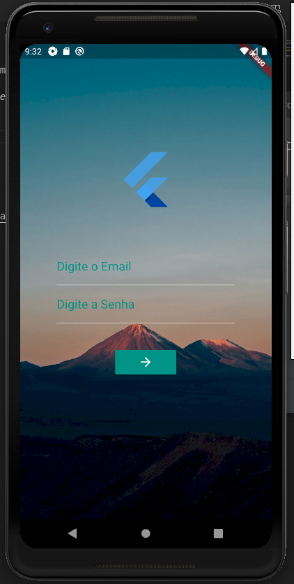
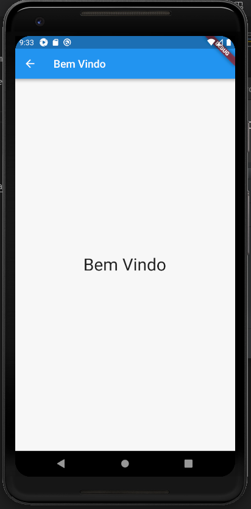

# Exemplo Login em Flutter

Repositório contendo um exemplo de funcionamento de uma tela de login desenvolvido em Flutter.

O próximo passo deste projeto é realização de teste *end-to-end* com a ferramenta *Robot Framework* com *Appium*.

O arquivo de instalação `.apk` para teste encontra-se na pasta *examples*.

**OBS:** para a primeira versão na possui validação os campos email e senha.

## Referências.

- [Flutter](https://flutter.io/)
- [Robot Framework](https://robotframework.org/robotframework/)
- [Appium](http://appium.io/)
